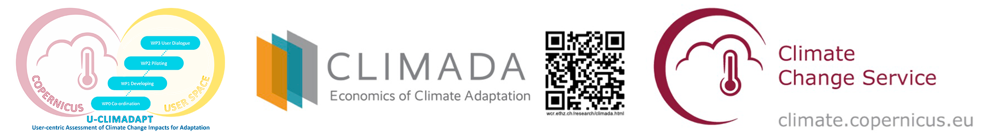

# **Copernicus Seasonal Forecast Tools Package Workshop** 


This repository contains two **Jupyter Notebooks** that showcases the functionalities of the new [Copernicus Seasonal Forecast Tools Package](https://github.com/DahyannAraya/copernicus-seasonal-forecast-tools). The module facilitates the management of **seasonal forecast data** from the [Copernicus Climate Data Store](https://cds.climate.copernicus.eu) (CDS) as part of the [U-CLIMADAPT project](https://www.copernicus-user-uptake.eu/user-uptake/details/responding-to-the-impact-of-climate-change-u-climadapt-488). 
This package provides comprehensive tools for downloading, processing, and computing climate indices, as well as generating hazard objects based on seasonal forecast datasets, particularly [Seasonal forecast daily and subdaily data on single levels](https://cds.climate.copernicus.eu/datasets/seasonal-original-single-levels?tab=overview). 
Designed for seamless integration with the [CLIMADA](https://climada.ethz.ch/) (CLIMate ADAptation) platform, this module supports climate risk assessment and facilitates the development of effective adaptation strategies.


## **Features**
- 📥 **Download** seasonal forecast data from CDS.
- 🔄 **Process** raw seasonal forecast datasets.
- 📊 **Compute climate indices** for analysis.
- 🌍 **Generate hazard objects** for climate risk assessment.
- 📈 **Impact calculation** using CLIMADA’s tools to:
  - Estimate population affected by heat index.
  - Map spatial impact patterns.
  - Analyze forecast impacts across ensemble members.
- 🛠️ **Integration with [CLIMADA](https://climada.ethz.ch/)** (CLIMate ADAptation) for climate impact modeling.

## **Requirements**

You can run the Colab notebooks provided in this workshop without any local installation or setup.

Each Colab notebook includes a **temporary CDS API key** configured for demonstration purposes. This key is only valid during the session and allows you to download seasonal forecast data from the [Copernicus Climate Data Store (CDS)](https://cds.climate.copernicus.eu).

> **Note:** If you plan to run the code **outside of Colab** (e.g., locally or on a server), you will need to register for a free CDS account and configure your **own API key**.  
> See our [CDS API setup guide](https://copernicus-seasonal-forecast-tools.readthedocs.io/en/latest/cds_api.html) for step-by-step instructions.


## **Usage**

This repository provides Jupyter Notebooks to work with the [Copernicus Seasonal Forecast Tools Package](https://github.com/DahyannAraya/copernicus-seasonal-forecast-tools).

There are two notebooks available:

- **`Modul_climada_copernicus_seasonal_forecast_workshop.ipynb`**: This is the first notebook to run. It demonstrates how to install and use the `seasonal-forecast-tools` to download, process, and convert seasonal forecast data into a CLIMADA hazard object.
- **`DEMO_Modul_climada_copernicus_seasonal_forecast_workshop.ipynb`**: This is the second notebook. It provides a full example application of the seasonal forecast hazard data in an end-to-end climate impact assessment pipeline.

### Notebooks

| Notebook | Open in Colab | GitHub Link |
|----------|----------------|-------------|
| `Modul_climada_copernicus_seasonal_forecast_workshop.ipynb` | [](https://colab.research.google.com/github/DahyannAraya/copernicus_climada_seasonal_forecast_workshop/blob/main/Modul_climada_copernicus_seasonal_forecast_workshop.ipynb) | [View on GitHub](https://github.com/DahyannAraya/copernicus_climada_seasonal_forecast_workshop/blob/main/Modul_climada_copernicus_seasonal_forecast_workshop.ipynb) |
| `DEMO_Modul_climada_copernicus_seasonal_forecast_workshop.ipynb` | [](https://colab.research.google.com/github/DahyannAraya/copernicus_climada_seasonal_forecast_workshop/blob/main/DEMO_Modul_climada_copernicus_seasonal_forecast_workshop.ipynb) | [View on GitHub](https://github.com/DahyannAraya/copernicus_climada_seasonal_forecast_workshop/blob/main/DEMO_Modul_climada_copernicus_seasonal_forecast_workshop.ipynb) |

---

### Run in Colab

1. Click on **Open in Colab** for the notebook of interest.
2. Make sure you follow all the setup cells in the notebook to install the dependencies.

---

### Run Locally

To run this workshop locally, you need to install the **Copernicus Seasonal Forecast Tools** package.

Follow the installation instructions provided in the official documentation:  
👉 [Installation Guide](https://copernicus-seasonal-forecast-tools.readthedocs.io/en/latest/)

Once the package is installed, you can clone this workshop repository:

```bash
git clone https://github.com/DahyannAraya/copernicus_climada_seasonal_forecast_workshop.git
cd copernicus_climada_seasonal_forecast_workshop
```

## **Resources**
- [U-CLIMADAPT Project](https://www.copernicus-user-uptake.eu/user-uptake/details/responding-to-the-impact-of-climate-change-u-climadapt-488)
- [Copernicus Seasonal Forecast on CLIMADA](to do)
- [Copernicus Seasonal Forecast Module extended demostration](https://colab.research.google.com/github/DahyannAraya/climada_copernicus_seasonal_forecast_workshop/blob/main/DEMO_Modul_climada_copernicus_seasonal_forecast_workshop.ipynb)
- [Seasonal forecast daily and subdaily data on single levels](https://cds.climate.copernicus.eu/datasets/seasonal-original-single-levels?tab=overview)
- [Copernicus Climate Data Store](https://cds.climate.copernicus.eu)
- [CLIMADA Documentation](https://climada.ethz.ch/)
